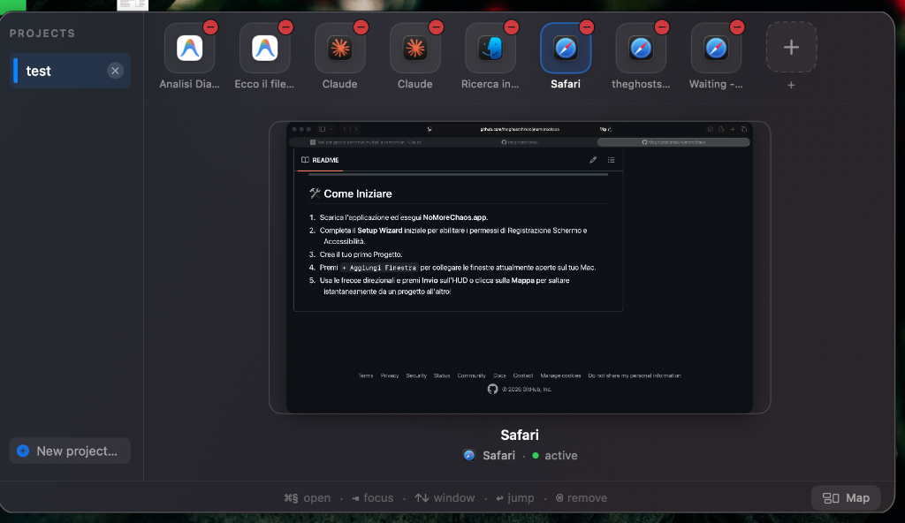
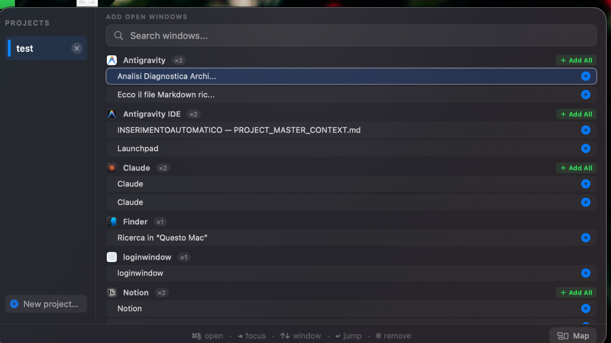
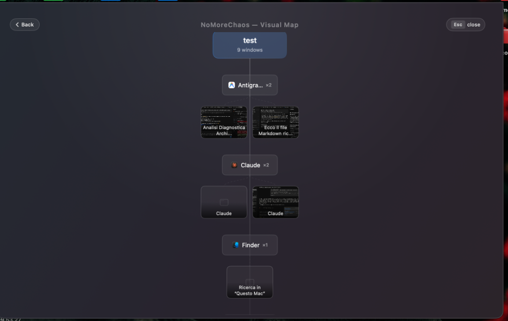

# NoMoreChaos

**NoMoreChaos** è un window manager premium per macOS progettato per eliminare il disordine visivo e organizzare in modo logico e fluido il tuo spazio di lavoro. Raggruppa le finestre aperte di qualsiasi applicazione in "Progetti" coerenti, permettendoti di saltare istantaneamente da un contesto all'altro senza distrazioni.

---

## 🚀 Caratteristiche Principali

### 1. Gestione dei Progetti e Preview HUD
Associa le finestre fisiche a specifici progetti personalizzati. L'interfaccia dell'HUD mostra le miniature live delle finestre assegnate con la possibilità di rimuoverle con un click.

### 2. Aggiunta Rapida delle Finestre
Visualizza l'elenco completo di tutte le finestre aperte sul tuo Mac, divise per applicazione, con la possibilità di aggiungere singole finestre o tutte le finestre di un applicativo in blocco (tramite il pulsante verde "+ Aggiungi tutte").

### 3. Mappa Visiva Interattiva
Visualizza la mappa ad albero di tutti i tuoi progetti e delle finestre collegate con connessioni grafiche dinamiche per capire a colpo d'occhio come sono organizzati i tuoi contesti di lavoro.

### 4. Evidenziamento Cornice Luminosa
Quando salti ad una finestra, questa viene messa in risalto istantaneamente con una cornice bianca sfumata ad alto contrasto con effetto bagliore (glow) per 1 secondo, per farti capire al volo dove sei atterrato.

### 5. Caricamento Anteprime Istantaneo
Utilizza una pipeline nativa ultra-rapida a bassa latenza (<10ms) per mostrare gli screenshot live delle finestre nell'HUD e nella Mappa.

---

## 🔒 Workflow delle Autorizzazioni di macOS

Per funzionare in modo corretto ed efficiente, NoMoreChaos richiede due permessi di sistema standard su macOS. L'app include un **Setup Wizard** iniziale che ti guida passo dopo passo nella configurazione:

### 1. Registrazione Schermo (Screen Recording)
* **Perché serve**: Consente a NoMoreChaos di catturare le miniature visive (screenshot live) delle finestre per mostrarti l'anteprima reale all'interno dell'HUD e della Mappa.
* **Sicurezza**: Le immagini vengono elaborate localmente e non vengono mai salvate su disco né trasmesse all'esterno.

### 2. Accessibilità (Accessibility)
* **Perché serve**: È lo standard utilizzato da tutti i window manager (come Rectangle o Magnet). Permette all'applicazione di comandare fisicamente lo spostamento, il ridimensionamento, la riduzione ad icona e l'attivazione in primo piano delle singole finestre quando esegui un salto.

---

## 🛠️ Come Iniziare

1. Scarica l'applicazione ed esegui **NoMoreChaos.app**.
2. Completa il **Setup Wizard** iniziale per abilitare i permessi di Registrazione Schermo e Accessibilità.
3. Crea il tuo primo Progetto.
4. Premi `+ Aggiungi Finestra` per collegare le finestre attualmente aperte sul tuo Mac.
5. Usa le frecce direzionali e premi **Invio** sull'HUD o clicca sulla **Mappa** per saltare istantaneamente da un progetto all'altro!
