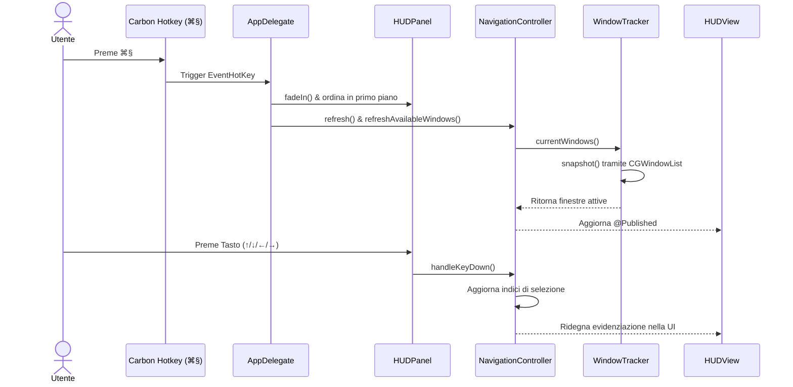
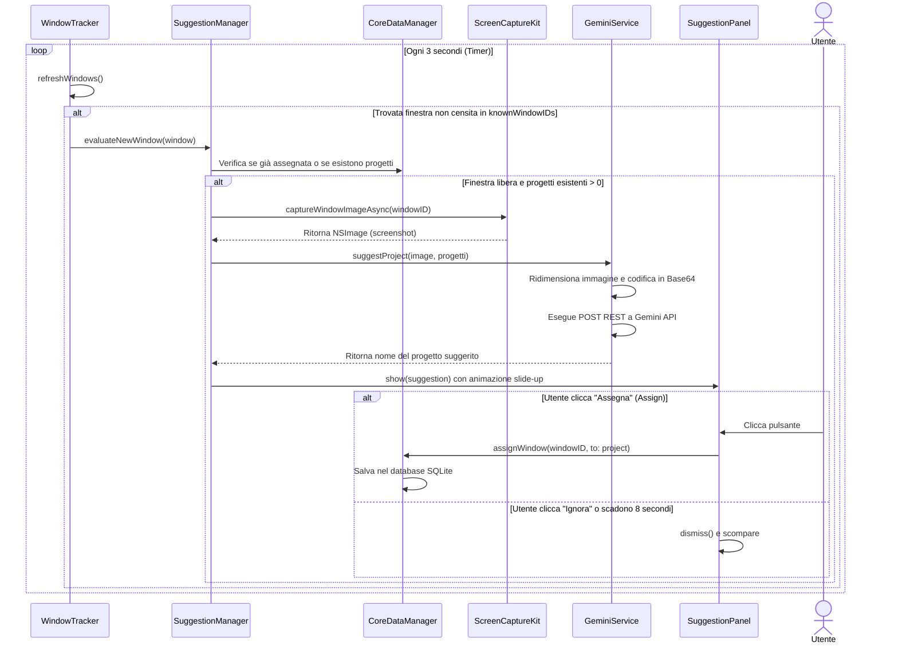
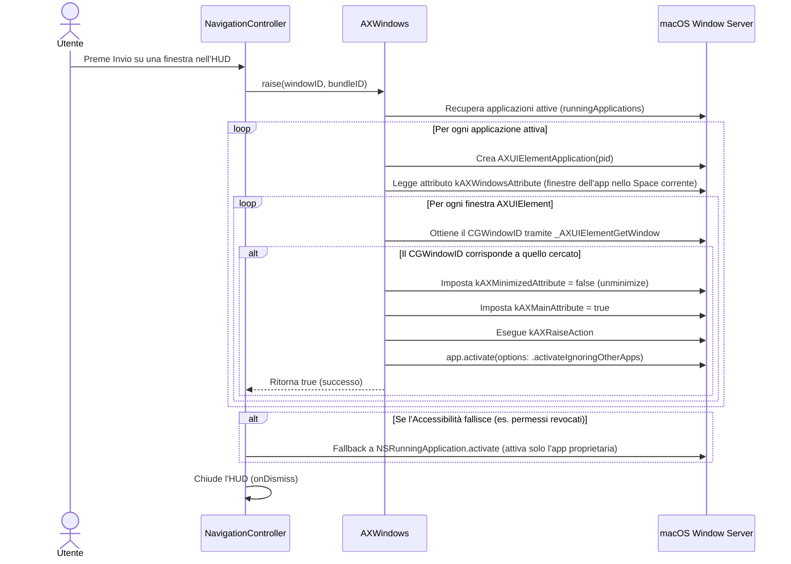
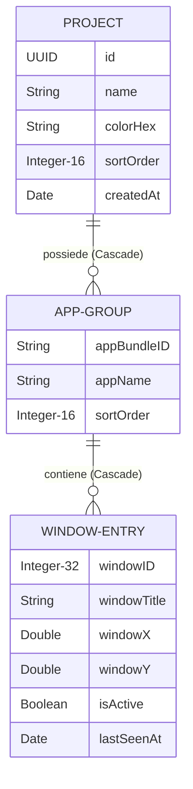

# Documento di Specifica Tecnica e Architettura: NoMoreChaos (macOS App)

Questo documento fornisce una descrizione tecnica dettagliata e completa del sistema **NoMoreChaos**, un'applicazione nativa per macOS progettata per raggruppare e gestire finestre di applicazioni in progetti logici, facilitando il multitasking e l'organizzazione dello schermo.

---

## SEZIONE 1 — VISIONE E OBIETTIVO

### Definizione in una frase
**NoMoreChaos** è un'utilità di sistema per macOS (LSUIElement) che consente agli utenti di raggruppare finestre aperte di qualsiasi applicazione in progetti logici personalizzati, permettendo di passare all'istante dall'una all'altra tramite una scorciatoia globale (⌘§) o una mappa visiva delle connessioni.

### Problema risolto e target di riferimento
Gli utenti che lavorano su molteplici progetti complessi (es. sviluppatori, designer, project manager) aprono frequentemente decine di finestre (Xcode, browser, Finder, terminali). macOS organizza le finestre per applicazione (es. tramite il Dock o ⌘Tab) e non per contesto di lavoro, costringendo l'utente a cercare continuamente le finestre correlate.
NoMoreChaos risolve la frammentazione del contesto operativo consentendo il raggruppamento logico inter-applicazione: finestre di app diverse ma appartenenti allo stesso progetto (es. un documento Figma, un workspace di Xcode e una pagina web di documentazione) vengono associate e richiamate con un unico tasto, indipendentemente dallo Space o desktop virtuale in cui si trovano.

### Obiettivo tecnico principale
Garantire un tracciamento robusto, leggero e persistente delle finestre aperte su tutti gli Spaces di macOS, offrendo anteprime visive in tempo reale (thumbnails) e un sistema di classificazione automatica assistito dall'intelligenza artificiale (Google Gemini API) in base all'analisi degli screenshot delle finestre stesse.

### Modalità operative
Trattandosi di un client desktop macOS nativo senza componenti server-side (ad eccezione delle chiamate API a Gemini), non esistono veri e propri ambienti distribuiti (dev/staging/prod). Il ciclo di vita prevede:
- **Development/Debug**: Esecuzione in Xcode con database di preview in-memory e logging verboso su console.
- **Production/Release**: Esecuzione come agente in background (`LSUIElement` attivo, nessuna icona nel Dock), persistenza SQLite via Core Data e configurazione persistente in `UserDefaults`.

### Filosofia architetturale e Trade-off
1. **Latenza vs. Reattività UI**: L'acquisizione delle informazioni sulle finestre (IPC con il Window Server) e la generazione delle miniature tramite *ScreenCaptureKit* sono operazioni potenzialmente janky. L'architettura sposta interamente questi carichi su thread in background gestiti in modo asincrono, aggiornando la UI tramite `ObservableObject` di SwiftUI solo al completamento.
2. **Uso di API Private vs. Sandboxing**: L'applicazione disabilita esplicitamente il sandboxing (`com.apple.security.app-sandbox` impostato a `false`) per poter enumerare i processi esterni, leggere i titoli delle finestre e acquisirne gli screenshot. Per correlare le informazioni di `CGWindowListCopyWindowInfo` (che lavora su tutti gli Spaces) con l'Accessibility API (necessaria per sollevare e focalizzare una finestra specifica), viene usata la funzione privata non documentata di sistema `_AXUIElementGetWindow`. Il trade-off accetta la dipendenza da un'API privata in cambio dell'abilità critica di operare su Spaces multipli.
3. **Firma Volatile delle Finestre**: Poiché il `CGWindowID` di macOS non è stabile (cambia a ogni riavvio dell'applicazione o del sistema), il sistema implementa un algoritmo di riconciliazione basato sulla combinazione univoca `(bundleID, windowTitle)`. In assenza di titolo (es. permessi non concessi), viene utilizzata la posizione geometrica `(x, y)` come tie-breaker.

### Stack Tecnologico
- **Linguaggio**: Swift 5.10 / Swift 6
- **Interfaccia Utente**: SwiftUI & AppKit (Cocoa)
- **Persistenza**: Core Data (SQLite come motore sottostante)
- **Framework di Sistema**: ScreenCaptureKit (macOS 14+), Carbon (registrazione tasti a basso livello), ServiceManagement (`SMAppService` per avvio al login), Combine
- **Modello di Intelligenza Artificiale**: Google Gemini 2.0 Flash (tramite chiamate REST HTTP asincrone)

### Dipendenze esterne
- **Google Gemini API**: Endpoint HTTP `generativelanguage.googleapis.com` utilizzato per inviare screenshot in formato PNG Base64 e ricevere suggerimenti sul progetto di appartenenza.

### Vincoli noti
- **Hardware**: Sistema operativo macOS 13.0+ (consigliato macOS 14.0+ per supporto completo a ScreenCaptureKit).
- **Licensing/Rate Limits**: Vincolato ai limiti d'uso della chiave API di Gemini fornita dall'utente.
- **Permessi TCC**: Richiede esplicitamente *Screen Recording* (per titoli e screenshot) e *Accessibility* (per interagire con le finestre).

---

## SEZIONE 2 — ARCHITETTURA GENERALE

### 1. Struttura directory ad albero
```
/Users/germainluperrto/Desktop/nomorechaos/
├── NoMoreChaos.xcodeproj
│   ├── project.pbxproj
│   ├── project.xcworkspace/
│   └── xcshareddata/
├── NoMoreChaos/
│   ├── NoMoreChaos.entitlements
│   ├── Info.plist
│   ├── NoMoreChaosApp.swift
│   ├── AppDelegate.swift
│   ├── AccessibilityWindows.swift
│   ├── WindowTracker.swift
│   ├── NavigationController.swift
│   ├── CoreDataManager.swift
│   ├── Persistence.swift
│   ├── GeminiService.swift
│   ├── SuggestionBannerView.swift
│   ├── HUDPanel.swift
│   ├── HUDView.swift
│   ├── MapPanel.swift
│   ├── MapView.swift
│   ├── ContentView.swift
│   ├── NoMoreChaos.xcdatamodeld/
│   │   ├── .xccurrentversion
│   │   └── NoMoreChaos.xcdatamodel/
│   │       └── contents
│   └── Assets.xcassets/
├── build/
├── falcon-menubar.svg
└── logo app.jpg
```

### 2. Ruolo dei componenti principali
- [NoMoreChaosApp.swift](file:///Users/germainluperrto/Desktop/nomorechaos/NoMoreChaos/NoMoreChaosApp.swift): Punto di ingresso dell'applicazione SwiftUI. Dichiara il ciclo di vita dell'app e la barra dei menu (`MenuBarExtra`).
- [AppDelegate.swift](file:///Users/germainluperrto/Desktop/nomorechaos/NoMoreChaos/AppDelegate.swift): Gestore del ciclo di vita classico di AppKit. Configura i pannelli floating dell'interfaccia, i permessi TCC, l'avvio automatico al login e registra gli hotkey globali Carbon (⌘§) e i monitor locali.
- [AccessibilityWindows.swift](file:///Users/germainluperrto/Desktop/nomorechaos/NoMoreChaos/AccessibilityWindows.swift): Estensione per interfacciarsi con le API di accessibilità macOS. Esegue la scansione dei processi attivi per localizzare un `CGWindowID` tramite la funzione non documentata `_AXUIElementGetWindow` e portarlo in primo piano.
- [WindowTracker.swift](file:///Users/germainluperrto/Desktop/nomorechaos/NoMoreChaos/WindowTracker.swift): Singleton responsabile della cattura periodica (timer a 3 secondi) dello stato delle finestre di sistema, del loro filtraggio e della notifica di nuove finestre al gestore dei suggerimenti AI.
- [NavigationController.swift](file:///Users/germainluperrto/Desktop/nomorechaos/NoMoreChaos/NavigationController.swift): Controller che gestisce lo stato di selezione dell'HUD (progetti, applicazioni, finestre) e si occupa della cattura asincrona degli screenshot e della transizione logica alla finestra di destinazione.
- [CoreDataManager.swift](file:///Users/germainluperrto/Desktop/nomorechaos/NoMoreChaos/CoreDataManager.swift): Livello di astrazione sul database di persistenza. Si occupa delle query di inserimento, eliminazione e della critica operazione di riconciliazione delle firme delle finestre all'avvio.
- [Persistence.swift](file:///Users/germainluperrto/Desktop/nomorechaos/NoMoreChaos/Persistence.swift): Configurazione dello stack Core Data, inclusa la gestione di istanze in-memory per scopi di preview o di testing.
- [GeminiService.swift](file:///Users/germainluperrto/Desktop/nomorechaos/NoMoreChaos/GeminiService.swift): Wrapper per l'integrazione di Gemini API. Gestisce il ridimensionamento delle immagini catturate e la chiamata POST asincrona.
- [SuggestionBannerView.swift](file:///Users/germainluperrto/Desktop/nomorechaos/NoMoreChaos/SuggestionBannerView.swift): Contiene la vista a pillola SwiftUI, il pannello overlay `SuggestionPanel` e il `SuggestionManager` che coordina la ricezione di nuove finestre, la generazione del suggerimento e l'assegnazione finale.
- [HUDPanel.swift](file:///Users/germainluperrto/Desktop/nomorechaos/NoMoreChaos/HUDPanel.swift): Finestra non-attivante di tipo `NSPanel` configurata a livello `.statusWindow + 1` per sovrapporsi a tutte le altre applicazioni (inclusi browser e app a schermo intero) per ospitare l'interfaccia dell'HUD.
- [HUDView.swift](file:///Users/germainluperrto/Desktop/nomorechaos/NoMoreChaos/HUDView.swift): Layout dell'HUD a 3 colonne (Progetti, Gruppi App/Finestre e Anteprima con statistiche di inattività) e l'interfaccia dell'assistente di onboarding (Wizard).
- [MapPanel.swift](file:///Users/germainluperrto/Desktop/nomorechaos/NoMoreChaos/MapPanel.swift): Pannello resitibile e spostabile che ospita la mappa visiva del progetto.
- [MapView.swift](file:///Users/germainluperrto/Desktop/nomorechaos/NoMoreChaos/MapView.swift): Interfaccia grafica che disegna una mappa concettuale (grafo) delle relazioni Progetto -> Applicazione -> Finestre con curve Bezier e animazioni elastiche.
- [ContentView.swift](file:///Users/germainluperrto/Desktop/nomorechaos/NoMoreChaos/ContentView.swift): Finestra standard del Project Manager, usata per configurazioni avanzate, cancellazione di progetti, inserimento manuale della chiave API e associazione manuale tramite picker.

### 3. Flusso dati end-to-end

#### Flusso A: Visualizzazione dell'HUD e Navigazione Tastiera


#### Flusso B: Rilevamento e Suggerimento AI di una Nuova Finestra


#### Flusso C: Salto a una Finestra Selezionata (Jump)


### 4. Mappa delle dipendenze dei componenti
- **Livello di Presentazione (UI)**: `HUDView`, `MapView`, `WizardView`, `ContentView` -> Dipendono da `NavigationController` per la logica di navigazione e da `Localizer` per le stringhe di lingua.
- **Livello Controller (Stato)**: `NavigationController` -> Dipende da `WindowTracker` per ottenere le finestre aperte e da `CoreDataManager` per salvare e caricare i record.
- **Livello Servizi di Sistema**: `WindowTracker` -> Dipende da `CoreDataManager` per riconciliare i dati ed effettua chiamate indirette a `SuggestionManager` per valutare le nuove finestre. `SuggestionManager` a sua volta dipende da `GeminiService` per l'inferenza AI e da `CoreDataManager` per scrivere l'assegnazione finale.
- **Livello Dati (Persistenza)**: `CoreDataManager` -> Gestisce l'accesso alle classi autogenerate di Core Data (`Project`, `AppGroup`, `WindowEntry`) sul contesto `NSManagedObjectContext` fornito da `PersistenceController`.

### 5. Sequenza di avvio del sistema (Startup Order)
1. **Inizializzazione App**: `NoMoreChaosApp` avvia le librerie SwiftUI. Viene creata l'istanza condivisa di `PersistenceController.shared`.
2. **Inizializzazione Delegate**: Viene instanziato l'adaptor `AppDelegate` e impostato in `AppDelegate.shared = self`.
3. **Pulizia Database**: Viene eseguito `CoreDataManager.purgeLegacyJunk()` per rimuovere record orfani generati da vecchie configurazioni del Window Server.
4. **Creazione Pannelli**: Vengono creati e configurati `HUDPanel` e `MapPanel` (entrambi inizialmente invisibili in memoria).
5. **Configurazione Shortcut**: Vengono chiamate le funzioni Carbon per registrare l'hotkey globale ⌘§ per i keycode `kVK_ISO_Section` (10) e `42`. Viene aggiunto il monitor locale NSEvent per intercettare lo stesso tasto quando l'app è key.
6. **Verifica Onboarding**: Viene letto il flag `onboardingComplete` da `UserDefaults`:
   - Se `true`, richiede asincronamente i permessi di Screen Recording e controlla l'Accessibilità.
   - Se `false`, invoca immediatamente `showWizard()` per presentare la guida di configurazione.
7. **Timer di Debug**: Viene avviato un timer di test che forza l'apertura dell'HUD dopo 2.5 secondi (da rimuovere in produzione ⚠️).

### 6. Punti di ingresso multipli
1. **Hotkey Globale ⌘§**: Gestito a livello Carbon in background, apre/chiude l'HUD.
2. **Menu Extra nella Barra dei Menu**: Fornisce pulsanti di attivazione rapidi per l'HUD, la Mappa, il Wizard, il Project Manager e il selettore istantaneo di lingua (EN/IT).
3. **Pulsante Mappa (M)**: Quando l'HUD is aperto, premere la lettera "M" (o cliccare il pulsante "Map") esegue una transizione chiudendo l'HUD e aprendo la mappa concettuale.

### 7. Pattern architetturali scelti
- **Hybrid MVVM/Controller**: `NavigationController` funge da ViewModel consolidato che incapsula lo stato visibile ed esegue i comandi per l'interfaccia SwiftUI. Evita lo sparpagliamento dello stato tra le tre colonne dell'HUD.
- **Singleton**: Garantisce che risorse pesanti come il timer di tracciamento delle finestre (`WindowTracker.shared`), il coordinatore dei suggerimenti AI (`SuggestionManager.shared`) e la cache delle finestre di ScreenCaptureKit (`ShareableContentCache.shared`) siano condivise senza duplicazione di thread o timer.
- **Coalescing Actor (Cache)**: L'actor `ShareableContentCache` (macOS 14+) implementa il pattern di coalescenza dei task asincroni. Se più richieste di screenshot avvengono nello stesso istante (es. all'apertura dell'HUD), viene eseguito un solo recupero hardware del layout delle finestre, riducendo l'overhead IPC del Window Server.

---

## SEZIONE 3 — BACKEND / CORE LOGIC

### FILE: `AccessibilityWindows.swift`
- **CLASSE principale**: `AXWindows` (enum namespace)
- **COMPLESSITÀ**: `CRITICAL` 🔴
- **RESPONSABILITÀ**: Implementa il nucleo di focalizzazione di una finestra specifica. Interroga l'API di accessibilità di macOS per mappare un `CGWindowID` volatile in un `AXUIElement` e sollevarlo in primo piano, superando i limiti degli Spaces.
- **INPUT**: `windowID: CGWindowID` (l'identificatore a 32 bit della finestra), `bundleID: String?` (opzionale, per accelerare la ricerca filtrando per app).
- **OUTPUT**: `Bool` (indica se la finestra è stata trovata e portata in primo piano con successo).
- **DIPENDENZE**: `ApplicationServices`, API privata `_AXUIElementGetWindow`.
- **PARAMETRI CHIAVE**: `MessagingTimeout: 0.3` (limita il blocco IPC in caso di applicazioni non rispondenti).
- **STATO INTERNO**: Nessuno (funzioni statiche stateless).
- **SIDE EFFECTS**: Modifica lo stato visivo globale del sistema operativo spostando il focus dell'utente su un'altra finestra e attivando l'applicazione proprietaria.
- **THREAD SAFETY**: Chiamato principalmente sul thread principale per prevenire conflitti con la manipolazione della UI di sistema.
- **ERROR HANDLING**: Ritorna `false` se una chiamata all'API di accessibilità fallisce (es. timeout o permessi non concessi), permettendo al chiamante di eseguire un fallback elementare basato su `NSRunningApplication`.
- **HARDCODED ⚠️**: Nessuno.
- **MEMORY ⚠️**: Nessuno.

---

### FILE: `AppDelegate.swift`
- **CLASSE principale**: `AppDelegate`
- **COMPLESSITÀ**: `COMPLEX`
- **RESPONSABILITÀ**: Punto centrale di coordinamento del ciclo di vita dell'applicazione. Configura i pannelli AppKit, registra gli hotkey globali tramite le API storiche Carbon e monitora i permessi TCC del sistema.
- **INPUT**: Notifiche di sistema (`applicationDidFinishLaunching`, etc.).
- **OUTPUT**: Gestione delle finestre di sistema (`HUDPanel`, `MapPanel`, `WizardPanel`).
- **DIPENDENZE**: `Carbon.HIToolbox`, `ServiceManagement` (`SMAppService`), `ApplicationServices`.
- **PARAMETRI CHIAVE**:
  - `hotkeyKeyCodes: [10, 42]` (i codici tasto per la sezione "§" sulle tastiere Apple italiane).
  - `delay: 2.5` (tempo di attesa per l'apertura automatica di prova all'avvio).
- **STATO INTERNO**: Riferimenti ai pannelli visualizzati, gestore degli hotkey Carbon (`EventHotKeyRef`), e monitor locale di eventi tastiera.
- **SIDE EFFECTS**: Registra listener globali a livello di sistema operativo per catturare la tastiera dell'utente. Scrive flag in `UserDefaults`.
- **THREAD SAFETY**: Richiede l'esecuzione sul Thread Principale (`@main` thread) per tutte le interazioni con i pannelli AppKit.
- **ERROR HANDLING**: Il fallimento della registrazione degli elementi di avvio o degli hotkey viene loggato a console senza crashare l'app.
- **HARDCODED ⚠️**:
  - Il timer di debug di 2.5 secondi all'avvio che apre forzatamente l'HUD (Linee 56-59).
  - Codice identificativo dell'hotkey (`0x4E4D4348` alias `'NMCH'`).
- **MEMORY ⚠️**: Gli handler di animazione contengono catture deboli (`[weak self]`) per prevenire cicli di retain con i pannelli.

---

### FILE: `CoreDataManager.swift`
- **CLASSE principale**: `CoreDataManager`
- **COMPLESSITÀ**: `CRITICAL` 🔴
- **RESPONSABILITÀ**: Gestisce lo schema relazionale dei progetti e delle finestre. Implementa l'algoritmo di riconciliazione che associa le finestre fisiche volatili ai record persistiti basandosi sulla firma logica delle finestre.
- **INPUT**: Liste di `TrackedWindow`, identificatori, titoli, coordinate spaziali.
- **OUTPUT**: Record Core Data (`Project`, `AppGroup`, `WindowEntry`).
- **DIPENDENZE**: `CoreData` stack locale.
- **PARAMETRI CHIAVE**: Nessuno.
- **STATO INTERNO**: Riferimento al contesto di persistenza (`viewContext`).
- **SIDE EFFECTS**: Esegue letture e scritture sincrone sul database SQLite locale dell'applicazione.
- **THREAD SAFETY**: Le operazioni vengono eseguite sul thread del contesto (in questo caso, il thread principale associato a `viewContext`).
- **ERROR HANDLING**: Errori di scrittura/lettura Core Data vengono catturati e stampati in console (`try?`, `catch`).
- **HARDCODED ⚠️**: Colore predefinito del progetto impostato come stringa fissa `#0A84FF` (Linea 13).
- **MEMORY ⚠️**: Nessuno. La cancellazione a cascata (`Cascade`) è configurata sul modello per prevenire record orfani.

---

### FILE: `GeminiService.swift`
- **CLASSE principale**: `GeminiService`
- **COMPLESSITÀ**: `MODERATE`
- **RESPONSABILITÀ**: Interfaccia con i servizi AI di Google. Ridimensiona gli screenshot delle finestre per ridurre il payload della richiesta, li codifica in Base64 e interroga il modello Gemini Flash per classificare la finestra.
- **INPUT**: `image: NSImage` (screenshot), `projectNames: [String]` (elenco dei progetti correnti).
- **OUTPUT**: `String?` (il nome del progetto suggerito in caso di match, altrimenti `nil`).
- **DIPENDENZE**: URLSession, JSONSerialization, estensione NSImage.
- **PARAMETRI CHIAVE**:
  - `maxWidth: 1024` (limite di larghezza per il ridimensionamento dello screenshot).
  - `timeoutInterval: 15` (timeout di connessione in secondi per la chiamata di rete).
  - Modello AI fisso: `gemini-2.0-flash:generateContent`.
- **STATO INTERNO**: Nessuno.
- **SIDE EFFECTS**: Effettua traffico di rete in uscita e consuma quote dell'API Key memorizzata.
- **THREAD SAFETY**: Utilizza la programmazione asincrona di Swift (`async/await`), sicuro da chiamare da contesti concorrenti.
- **ERROR HANDLING**: Gestisce codici di stato HTTP non-200 e fallimenti di rete restituendo `nil` ed evitando blocchi dell'interfaccia.
- **HARDCODED ⚠️**:
  - Prompt di sistema integrato in italiano nel codice sorgente (Linee 35-40).
  - URL dell'endpoint di Google (Linea 54).
- **MEMORY ⚠️**: Il metodo `resizedForAPI` esegue una copia dell'immagine in memoria grafica temporanea liberata al termine del contesto.

---

### FILE: `WindowTracker.swift`
- **CLASSE principale**: `WindowTracker`
- **COMPLESSITÀ**: `COMPLEX`
- **RESPONSABILITÀ**: Scansiona periodicamente il gestore delle finestre di macOS, rimuove i processi invisibili, i menu e i pannelli di sistema (applicando filtri di dimensione e layer) e avvia il flusso AI per le nuove finestre.
- **INPUT**: Dati grezzi da `CGWindowListCopyWindowInfo`.
- **OUTPUT**: Array pubblicato di `TrackedWindow` strutturate.
- **DIPENDENZE**: `CoreDataManager`, `SuggestionManager`, `Combine`.
- **PARAMETRI CHIAVE**:
  - Timer: `3.0` secondi (intervallo di polling per il rilevamento).
  - Limite dimensioni: `120x120` (dimensione minima per qualificare una finestra).
  - Limite finestre senza titolo: `400x300` (finestre grandi su schermo qualificate anche se prive di titolo).
- **STATO INTERNO**: Set di `knownWindowIDs` per evitare di elaborare più volte la stessa finestra e timer attivo sul RunLoop principale.
- **SIDE EFFECTS**: Esegue operazioni IPC con il Window Server. Invoca asincronamente `reconcile` sul thread principale.
- **THREAD SAFETY**: La scansione iniziale avviene in background (`DispatchQueue.global`), ma la modifica della proprietà `@Published var windows` e le interazioni Core Data vengono forzatamente spostate sul thread principale (`DispatchQueue.main.async`).
- **ERROR HANDLING**: Se `CGWindowListCopyWindowInfo` restituisce `nil`, l'applicazione mantiene la lista delle finestre precedente senza andare in crash.
- **HARDCODED ⚠️**:
  - Intervallo di polling di 3 secondi hardcoded nel costruttore (Linea 172).
  - Soglie di dimensione geometrica delle finestre (Linee 95, 103).
- **MEMORY ⚠️**: Il timer tiene un riferimento debole (`[weak self]`) per prevenire la mancata deallocazione se il singleton venisse distrutto.

---

### FILE: `NavigationController.swift`
- **CLASSE principale**: `NavigationController`
- **COMPLESSITÀ**: `COMPLEX`
- **RESPONSABILITÀ**: Gestisce la logica di navigazione della tastiera nell'HUD, supporta l'acquisizione delle immagini delle finestre tramite il moderno framework `ScreenCaptureKit` (macOS 14+) o le API legacy (macOS 13) e coordina le chiamate di salto.
- **INPUT**: Interazioni utente, tasti premuti.
- **OUTPUT**: Stato di selezione visiva, esecuzione del focus della finestra.
- **DIPENDENZE**: `ScreenCaptureKit`, `CoreDataManager`, `WindowTracker`, `ShareableContentCache`.
- **PARAMETRI CHIAVE**:
  - `pointPixelScale` (fattore di scala dello schermo per determinare la risoluzione dello screenshot).
- **STATO INTERNO**: Indici selezionati per Progetti, Gruppi e Finestre; liste caricate e mappature dei proprietari delle finestre.
- **SIDE EFFECTS**: Salva modifiche al contesto Core Data quando viene effettuata una nuova assegnazione o disassociazione. Invoca l'attivazione di applicazioni esterne.
- **THREAD SAFETY**: Le funzioni di selezione sono confinate sul thread principale. L'acquisizione delle immagini è gestita asincronamente.
- **ERROR HANDLING**: In caso di fallimento di ScreenCaptureKit (es. finestra chiusa durante la cattura), tenta di invalidare la cache di sistema o ricade sulla cattura legacy.
- **HARDCODED ⚠️**:
  - Colori di fallback nel codice (`#0A84FF`, `.blue`).
- **MEMORY ⚠️**: L'actor `ShareableContentCache` memorizza l'istanza `SCShareableContent` con un TTL di 0.5 secondi per prevenire l'accumulo di memoria grafica.

---

## SEZIONE 4 — DATABASE E PERSISTENZA

### 1. Tipo e versione
NoMoreChaos utilizza lo stack nativo **Core Data** integrato nel sistema operativo macOS. Lo store fisico sottostante è un database relazionale **SQLite 3**.

### 2. File di persistenza
Il file del database SQLite viene creato automaticamente all'interno della directory Application Support dell'utente:
`~/Library/Application Support/NoMoreChaos/NoMoreChaos.sqlite`
*(Nota: Per scopi di testing/preview è possibile istanziare lo store in-memory mappando l'URL su `/dev/null`)*.

### 3. Schema del database (Entity Model)

#### Entità A: `Project`
Rappresenta un gruppo logico definito dall'utente per raggruppare le finestre.
- Attributes:
  - `colorHex` (String, Optional: `true`, Default: `#0A84FF`): Colore esadecimale associato al progetto nella UI.
  - `createdAt` (Date, Optional: `true`): Data e ora di creazione del progetto.
  - `id` (UUID, Optional: `true`): Identificatore univoco del progetto.
  - `name` (String, Optional: `true`): Nome visualizzato del progetto.
  - `sortOrder` (Integer 16, Optional: `true`, Default: `0`): Posizione di ordinamento del progetto nella sidebar.
- Relationships:
  - `appGroups` (Destination: `AppGroup`, Type: To-Many, Deletion Rule: `Cascade`, Inverse: `project`): Gruppi di applicazioni associati a questo progetto.

#### Entità B: `AppGroup`
Raggruppa le finestre di una specifica applicazione (identificata dal bundle ID) all'interno di un progetto.
- Attributes:
  - `appBundleID` (String, Optional: `true`): Identificatore di bundle dell'applicazione (es. `com.apple.Safari`).
  - `appName` (String, Optional: `true`): Nome dell'applicazione visualizzato (es. `Safari`).
  - `sortOrder` (Integer 16, Optional: `true`, Default: `0`): Ordinamento interno.
- Relationships:
  - `project` (Destination: `Project`, Type: To-One, Deletion Rule: `Nullify`, Inverse: `appGroups`): Progetto a cui appartiene questo gruppo.
  - `windowEntries` (Destination: `WindowEntry`, Type: To-Many, Deletion Rule: `Cascade`, Inverse: `appGroup`): Finestre appartenenti a questa applicazione in questo progetto.

#### Entità C: `WindowEntry`
Rappresenta una specifica finestra memorizzata appartenente a un gruppo di applicazioni.
- Attributes:
  - `isActive` (Boolean, Optional: `true`): Indica se la finestra è attualmente aperta sul sistema.
  - `lastSeenAt` (Date, Optional: `true`): Data dell'ultima scansione in cui la finestra è apparsa attiva.
  - `windowID` (Integer 32, Optional: `true`, Default: `0`): Il `CGWindowID` di macOS (volatile, aggiornato dinamicamente).
  - `windowTitle` (String, Optional: `true`): Titolo della finestra (es. il titolo di una pagina web o di un file).
  - `windowX` (Double, Optional: `true`, Default: `0`): Posizione X sullo schermo.
  - `windowY` (Double, Optional: `true`, Default: `0`): Posizione Y sullo schermo.
- Relationships:
  - `appGroup` (Destination: `AppGroup`, Type: To-One, Deletion Rule: `Nullify`, Inverse: `windowEntries`): Gruppo di applicazioni a cui appartiene questa finestra.



### 4. Operazioni e Query Critiche
L'operazione più critica per le performance è la **Riconciliazione** (`reconcile(openWindows:)`), eseguita a ogni ciclo del timer di 3 secondi. Essa:
1. Recupera l'elenco completo delle finestre fisiche attive.
2. Esegue una fetch Core Data di tutti i record `WindowEntry`.
3. Associa le finestre esistenti basandosi sulla corrispondenza delle firme `(bundleID, title)` o `(bundleID, x, y)`.
4. Se una finestra memorizzata è attiva sul sistema, ne aggiorna il `windowID` logico temporaneo e imposta `isActive = true`.
5. Se una finestra non viene più rilevata, viene impostata su `isActive = false` per mantenere l'associazione in attesa di una futura riapertura.

### 5. Strategia di migrazione
I cambiamenti nello schema vengono gestiti tramite **Lightweight Migration** di Core Data (inferenza automatica delle differenze da parte di Xcode/Core Data). Essendo uno schema semplice basato su SQLite locale, non sono necessari passaggi complessi di migrazione custom.

### 6. Modalità speciali
Il contesto del visualizzatore (`viewContext`) è configurato con:
- `automaticallyMergesChangesFromParent = true`: Per unire automaticamente i cambiamenti eseguiti da thread secondari.
- `mergePolicy = NSMergeByPropertyObjectTrumpMergePolicy`: In caso di conflitti di scrittura, prevale lo stato dell'oggetto in memoria rispetto a quello sul database.

---

## SEZIONE 5 — API E INTERFACCE

L'unica interfaccia di rete esterna dell'applicazione è la chiamata REST asincrona a Google Gemini.

### POST `https://generativelanguage.googleapis.com/v1beta/models/gemini-2.0-flash:generateContent?key=\(apiKey)`

#### Descrizione
Invia lo screenshot di una nuova finestra macOS rilevata e la lista dei progetti creati dall'utente per ottenere una categorizzazione automatica.

#### Autenticazione
Chiave API passata direttamente nella query string (`?key=...`). Recuperata a runtime dall'utente tramite `UserDefaults` (`geminiAPIKey`).

#### Schema Richiesta (JSON Payload)
```json
{
  "contents": [
    {
      "parts": [
        {
          "text": "Guarda questo screenshot di una finestra macOS. I progetti disponibili sono: ProgettoA, ProgettoB. A quale progetto appartiene questa finestra? Rispondi SOLO con il nome esatto del progetto, nient'altro."
        },
        {
          "inline_data": {
            "mime_type": "image/png",
            "data": "<BASE64_DELL_IMMAGINE_PNG>"
          }
        }
      ]
    }
  ]
}
```

#### Schema Risposta Successo (JSON)
```json
{
  "candidates": [
    {
      "content": {
        "parts": [
          {
            "text": "ProgettoA\n"
          }
        ]
      }
    }
  ]
}
```

#### Gestione Errori
- **HTTP 400/403**: Chiave API non valida o formato errato. Gestito stampando l'errore a console e restituendo `nil`.
- **Nessuna risposta o rete assente**: Intercettato dal blocco `do-catch` di URLSession, restituisce immediatamente `nil` senza bloccare il thread.

---

## SEZIONE 6 — FRONTEND / CLIENT

L'interfaccia utente è sviluppata interamente in **SwiftUI**, sfruttando la reattività di `@Published` e `@ObservedObject` per l'aggiornamento grafico.

### 1. Struttura dei Componenti Visivi

```
HUDPanel (NSPanel)
└── HUDView (SwiftUI Root)
    ├── Sezione Onboarding (se progetti.isEmpty)
    │   └── CubeLogoView (Logo wireframe vettoriale)
    └── Sezione Principale (mainLayout)
        ├── Colonna 1: projectColumn (Sidebar sinistra)
        │   └── Sezione Aggiungi Progetto (addProjectField)
        ├── Colonna 2: appGroupColumn (Griglia centrale)
        │   ├── Sezione Finestre Assegnate
        │   │   ├── AppIconView (Icona nativa estratta dal bundle ID)
        │   │   └── WindowThumbnailView (Miniatura catturata 80×55)
        │   └── Sezione Finestre Disponibili (availableWindowsSection)
        ├── Colonna 3: previewColumn (Anteprima destra)
        │   └── WindowPreviewView (Screenshot della finestra selezionata 360×240)
        └── Barra inferiore: bottomBar (Legenda scorciatoie)
```

### 2. Componenti Chiave e Dettaglio Tecnico

#### `AppIconView`
- **Descrizione**: Wrapper AppKit (`NSViewRepresentable`) che interroga `NSWorkspace` per caricare l'icona dell'applicazione partendo dal bundle ID (`urlForApplication(withBundleIdentifier:)`). Se l'applicazione non è installata o non viene trovata, mostra un'icona di fallback di sistema (`app.fill`).

#### `WindowThumbnailView` & `WindowPreviewView`
- **Descrizione**: Visualizzano le immagini delle finestre. Eseguono un task asincrono all'apparire (`onAppear`) o al cambio del `windowID` per invocare `captureWindowImageAsync`. Gestiscono lo stato di caricamento mostrando un'icona generica o un indicatore di progresso rotante (`ProgressView`).

#### `MapView` (Visual Map)
- **Descrizione**: Vista interattiva dei nodi del progetto.
- **Preference Key**: Usa `NodeAnchorKey` per raccogliere dinamicamente il baricentro grafico di ogni nodo sullo schermo all'interno dello spazio coordinate `.coordinateSpace(name: "mapSpace")`.
- **Canvas Drawing**: Disegna in background le linee Bezier che connettono visivamente i nodi: linee solide bianche opache per Progetto -> AppGroup e linee tratteggiate bianche semitrasparenti per AppGroup -> Finestre.
- **Animazioni**: Utilizza transizioni elastiche `staggerIn` con ritardo progressivo (`delay`) calcolato sull'indice globale dell'elemento per dare un effetto premium di "comparsa guidata" all'apertura del pannello.

#### `WizardView`
- **Descrizione**: Flusso sequenziale in 6 passaggi gestito da uno stato interno (`step`). Interroga periodicamente tramite un timer locale (`Timer.publish`) lo stato dei permessi di Screen Recording e di Accessibilità del sistema, aggiornando i badge grafici (verde/rosso) in tempo reale mentre l'utente modifica le impostazioni nelle preferenze di sistema di macOS.

### 3. Styling e Temizzazione
- **Design System**: Sfrutta le trasparenze fornite dal materiale nativo `.hudWindow` e dal blending `.behindWindow` per ottenere l'effetto *frosted glass* (vetro satinato).
- **Fallback**: Viene sovrapposto un colore di sfondo solido nero al 55% o all'88% per garantire che il testo sia sempre leggibile indipendentemente dallo sfondo scrivania dell'utente.
- **Colori**: Curati dinamicamente estraendo i valori HEX memorizzati nei progetti, consentendo la retrocompatibilità con i temi scuri di macOS.

---

## SEZIONE 7 — FLUSSO COMPLETO DI UN'OPERAZIONE

Di seguito viene descritto il flusso dettagliato delle tre operazioni principali.

### OPERAZIONE 1: Apertura dell'HUD e Visualizzazione Finestre (⌘§)

- **STEP 1**: L'utente preme la combinazione ⌘§ in qualsiasi applicazione attiva.
  - *Chi*: Evento intercettato da Carbon (`RegisterEventHotKey`).
  - *Cosa*: Viene invocata la callback del gestore hotkey che esegue `DispatchQueue.main.async { AppDelegate.toggleHUD() }`.
  - *Timeout/Fallback*: Se il focus è già sul pannello di NoMoreChaos, l'evento viene intercettato anche dal monitor locale `localHotkeyMonitor` per chiudere l'HUD.
- **STEP 2**: Centratura e visualizzazione del pannello.
  - *Chi*: `HUDPanel`.
  - *Cosa*: Calcola il monitor attivo su cui si trova il puntatore del mouse (`NSScreen.active`) e centra la finestra su di esso (`centeredOrigin(for:)`). Cambia l'opacità da 0 a 1 in 0.15 secondi (`fadeIn()`).
- **STEP 3**: Raccolta ed elaborazione dei dati.
  - *Chi*: `NavigationController`.
  - *Cosa*: Esegue `refresh()` caricando i progetti e richiama `windowTracker.currentWindows()`.
  - *DB*: Esegue una fetch in sola lettura per ottenere i progetti ordinati per `sortOrder`.
  - *Latenza*: ~5-15ms.

---

### OPERAZIONE 2: Rilevamento e Categorizzazione AI di una Nuova Finestra

- **STEP 1**: Rilevamento periodico.
  - *Chi*: `WindowTracker` (Timer).
  - *Cosa*: Il timer a 3 secondi esegue `refreshWindows()` che esegue lo snapshot in background e confronta gli ID trovati con `knownWindowIDs`.
  - *Latenza*: Operazione asincrona non bloccante.
- **STEP 2**: Avvio del flusso di valutazione.
  - *Chi*: `SuggestionManager`.
  - *Cosa*: Riceve la finestra, esegue `projectForWindow` in Core Data per verificare che sia libera e recupera i nomi dei progetti esistenti.
  - *DB*: Fetch su `WindowEntry` per verificare l'assegnazione e su `Project` per raccogliere i nomi.
- **STEP 3**: Screenshot e Invio alle API.
  - *Chi*: `ScreenCaptureKit` e `GeminiService`.
  - *Cosa*: ScreenCaptureKit estrae lo screenshot PNG asincrono. GeminiService esegue la chiamata POST REST.
  - *Timeout*: 15 secondi sulla chiamata HTTP.
  - *Fallback*: Se la connessione fallisce o l'immagine è vuota, il processo si interrompe silenziosamente.
- **STEP 4**: Visualizzazione e Assegnazione.
  - *Chi*: `SuggestionPanel` e Utente.
  - *Cosa*: Viene mostrata la pillola in basso sullo schermo. Se l'utente clicca "Assegna", viene creato il record `WindowEntry` associato al progetto.
  - *DB*: Inserimento di `WindowEntry` e aggiornamento di `AppGroup`.

---

### OPERAZIONE 3: Salto alla Finestra Selezionata (Jump)

- **STEP 1**: Pressione del tasto Invio.
  - *Chi*: `HUDPanel` intercetta la tastiera ed esegue `jumpToSelectedWindow()` in `NavigationController`.
- **STEP 2**: Sollevamento tramite Accessibilità.
  - *Chi*: `AXWindows.raise(windowID:bundleID:)`.
  - *Cosa*: Esegue una ricerca per PID dell'applicazione, interroga l'accessibilità per trovare la finestra avente `CGWindowID` corrispondente, la de-minimizza se necessario, e la imposta come Main/Key Window, attivando l'applicazione con l'opzione `.activateIgnoringOtherApps`.
  - *Latenza*: ~50-150ms a seconda del carico di sistema.
  - *Fallback*: Se la finestra non risponde o i permessi di accessibilità sono assenti, recupera il PID da `CGWindowList` ed esegue `NSRunningApplication.activate(options:)` per portare in primo piano l'applicazione generica.
- **STEP 3**: Chiusura dell'interfaccia.
  - *Chi*: `HUDPanel`.
  - *Cosa*: Avvia la transizione di dissolvenza in uscita (`fadeOut()`) in 0.15 secondi, rimuovendo i listener di click e tasti.

---

## SEZIONE 8 — CONFIGURAZIONE E PARAMETRI

| PARAMETRO | VALORE DEFAULT | RANGE/TIPO | FILE / STORAGE | IMPATTO SE INCREMENTATO | IMPATTO SE DECREMENTATO |
| :--- | :--- | :--- | :--- | :--- | :--- |
| `geminiAPIKey` | vuoto `""` | Stringa / Chiave API | `UserDefaults` / `@AppStorage` | Permette il funzionamento delle funzioni AI. | Disabilita completamente i suggerimenti AI delle nuove finestre. |
| `appLanguage` | `"en"` | Stringa / `["en", "it"]` | `UserDefaults` / `Localizer` | Cambia istantaneamente la lingua in italiano. | Imposta la lingua predefinita in inglese. |
| `onboardingComplete` | `false` | Booleano | `UserDefaults` | Salta il wizard all'avvio dell'applicazione. | Forza la visualizzazione del wizard ad ogni avvio dell'app. |
| **Window Filter Size** | `120` | Double / Pixel | `WindowTracker.swift` | Esclude più finestre (rischio di ignorare finestre reali piccole). | Include più elementi (rischio di includere menu-bar invisibili, popover, helper). |
| **Untitled Size Filter** | `400`x`300` | Double / Pixel | `WindowTracker.swift` | Esclude le finestre senza titolo non abbastanza grandi. | Mostra finestre senza titolo piccolissime nella UI dell'HUD. |
| **Window Poll Interval** | `3.0` | Double / Secondi | `WindowTracker.swift` (HARDCODED ⚠️) | Riduce l'utilizzo di CPU, ma il rilevamento delle finestre è lento. | Aumenta il carico di CPU per via di continue chiamate IPC e query Core Data. |
| **Gemini Timeout** | `15.0` | Double / Secondi | `GeminiService.swift` (HARDCODED ⚠️) | Le chiamate lente a Gemini attendono di più prima di scadere. | Le chiamate a Gemini falliscono in presenza di connessioni non ottimali. |
| **Cache TTL** | `0.5` | Double / Secondi | `NavigationController.swift` (HARDCODED ⚠️) | Riduce l'overhead IPC, ma gli screenshot catturati possono risultare obsoleti. | Gli screenshot sono sempre aggiornatissimi, ma le performance calano drasticamente all'apertura dell'HUD. |

---

## SEZIONE 9 — SICUREZZA 🔒

### 1. Gestione dei Segreti (Secrets Management)
La chiave API di Google Gemini viene inserita dall'utente nel wizard o nel Project Manager e memorizzata direttamente nel dizionario di configurazione dell'applicazione `UserDefaults` in chiaro sotto la chiave `geminiAPIKey`.
- **Rischio**: SECURITY 🔒. Qualsiasi altro processo in esecuzione sul sistema con accesso alla lettura dei file plist di configurazione del dominio dell'applicazione potrebbe estrarre la chiave API.
- **Mitigazione**: Dovrebbe essere introdotto l'uso di *Keychain Services* di macOS per memorizzare la chiave in modo cifrato a livello di sistema operativo.

### 2. Disattivazione della Sandbox
Nel file `NoMoreChaos.entitlements` la chiave `com.apple.security.app-sandbox` è impostata su `false`.
- **Giustificazione**: La natura dell'applicazione (window manager e screenshotting cross-process) richiede permessi di basso livello incompatibili con le restrizioni della Sandbox di Apple. L'applicazione non può essere distribuita sul Mac App Store ufficiale a causa di questo vincolo, richiedendo la distribuzione diretta e la notarizzazione indipendente.

### 3. Validazione degli Input e Sanificazione
L'input inserito dall'utente per i nomi dei progetti viene sanificato tramite la rimozione degli spazi bianchi iniziali e finali (`trimmingCharacters(in: .whitespaces)`). In caso di stringhe vuote, l'operazione viene interrotta prevenendo record vuoti nel database.
I dati delle risposte JSON di Gemini vengono serializzati in modo sicuro tramite `JSONSerialization` ed estratti con controlli condizionali multipli (`guard let`) per evitare crash da dati malformati.

### 4. Superfici di Attacco Principali
- **Lettura dello Schermo (Screen Capture)**: L'acquisizione delle miniature e l'invio all'API esterna di Gemini espone potenzialmente dati sensibili presenti sullo schermo dell'utente (es. password o dati personali visibili all'interno delle finestre fotografate). Il sistema riduce il rischio ridimensionando l'immagine a max 1024px di larghezza prima della trasmissione.

---

## SEZIONE 10 — TESTING 🧪

### 1. Stato dei Test Automatizzati
Attualmente non sono presenti file di test automatizzati (Unit o UI tests) all'interno del progetto locale `/NoMoreChaos`.
Tuttavia, il codice supporta la configurazione per i test tramite la modalità di anteprima in-memory di Core Data (`PersistenceController.preview`), che permette di simulare un contesto transitorio ed effettuare asserzioni logiche.

### 2. Strategia di Testing Consigliata
- **Unit Test**: Testare il comportamento di `Localizer` per verificar la corretta restituzione delle stringhe in italiano e inglese, e l'algoritmo di calcolo della firma della finestra in `CoreDataManager.reconcile`.
- **Mocking**: Simulare le risposte dell'API Gemini e il Window Server per testare la logica di `WindowTracker` senza dipendere dall'hardware di sistema o dalla connessione internet.

---

## SEZIONE 11 — DEPLOYMENT E INFRASTRUTTURA

### 1. Compilazione e Distribuzione
NoMoreChaos viene compilato come pacchetto applicazione standard macOS (`.app`) tramite Xcode.
Non richiede server di backend proprietari o infrastrutture cloud personali, in quanto tutte le funzionalità ad eccezione dell'API Gemini avvengono localmente sul dispositivo dell'utente.

### 2. Gestione dell'avvio automatico
L'applicazione implementa `SMAppService.mainApp` per registrarsi nel sistema operativo come elemento di login (macOS 13+).
In questo modo, macOS avvia NoMoreChaos in background al login dell'utente, posizionando l'icona dell'app nella barra dei menu e attivando il listener globale della tastiera Carbon.

### 3. Endpoint di Health Check e Diagnostica
Non ci sono endpoint HTTP di diagnostica. Lo stato del sistema può essere monitorato tramite:
- **Verifica permessi**: Il wizard e la finestra principale interrogano costantemente `CGPreflightScreenCaptureAccess()` e `AXIsProcessTrusted()` per indicare all'utente se l'applicazione è operativa o bloccata.

---

## SEZIONE 12 — MONITORING E OBSERVABILITY

### 1. Logging
L'applicazione effettua log di base scrivendo direttamente su console standard (tramite istruzioni `print`).
- **Livelli di Log**:
  - `Core Data save error`: Generato in caso di errore di persistenza SQLite. Azione richiesta: verificare spazio su disco o corruzione del file `.sqlite`.
  - `[GeminiService] Network error`: Problemi di connessione a Google o API Key non valida.
  - `Login item toggle failed`: Errori di registrazione del servizio di avvio al login tramite `SMAppService`.

### 2. Procedure di debug in produzione
In caso di malfunzionamenti lamentati dall'utente (es. miniature vuote o tasto ⌘§ non funzionante):
1. Aprire l'applicazione Console di macOS e filtrare per il processo `NoMoreChaos`.
2. Verificare se sono presenti errori relativi ai permessi TCC.
3. Riavviare il servizio TCC da terminale per forzare macOS a richiedere nuovamente i permessi:
   `tccutil reset All com.nomorechaos.app` (o corrispondente bundle identifier).

---

## SEZIONE 13 — PROBLEMI NOTI E DEBITO TECNICO

### 1. Riconciliazione instabile per finestre senza titolo
- **Sintomo**: Finestre appartenenti allo stesso processo prive di titolo (es. due finestre Finder vuote o finestre di configurazione) vengono confuse tra di loro dopo lo spostamento sullo schermo o al riavvio del sistema.
- **Root Cause**: In assenza di titolo (comune se non sono concessi i permessi di registrazione schermo), l'algoritmo di firma utilizza la posizione geometrica `(x, y)` come tie-breaker. Se l'utente sposta la finestra, la firma cambia, spezzando il collegamento Core Data.
- **Impatto**: `MEDIUM`.
- **Fix Proposto**: Integrare identificativi più robusti forniti dalle API di accessibilità avanzate (es. `kAXWindowRole` o attributi interni) laddove disponibili.

### 2. Memorizzazione insicura della Chiave API Gemini
- **Sintomo**: La chiave API di Gemini è leggibile in chiaro da chiunque acceda al file delle impostazioni UserDefaults dell'utente.
- **Root Cause**: Utilizzo di `@AppStorage("geminiAPIKey")` per semplicità di sviluppo al posto delle API Keychain di Apple.
- **Impatto**: `HIGH` 🔒 (Rischio di furto di credenziali API).
- **Fix Proposto**: Riscrivere il getter/setter di `GeminiService` e la vista delle impostazioni per salvare e leggere la chiave utilizzando la libreria Security di macOS (Keychain).

### 3. Presenza di codice di test fisso in produzione
- **Sintomo**: L'HUD si apre automaticamente 2.5 secondi dopo l'avvio dell'applicazione, anche se l'utente non ha premuto l'hotkey.
- **Root Cause**: Codice di debug temporaneo inserito in `AppDelegate.swift` (Linee 56-59) per scopi di screenshotting automatico.
- **Impatto**: `MEDIUM` (Disturbo per l'utente all'avvio).
- **Fix Proposto**: Rimuovere il blocco di codice `DispatchQueue.main.asyncAfter` in `AppDelegate.swift` prima di effettuare la build di rilascio.

---

## SEZIONE 14 — ONBOARDING RAPIDO

### 1. Setup dell'Ambiente Locale
- **Prerequisiti**:
  - Mac con macOS 14.0+ (consigliato per ScreenCaptureKit completo).
  - Xcode 15.0+ con riga di comando installata.
- **Passi per la configurazione**:
  1. Aprire il file di progetto `NoMoreChaos.xcodeproj` in Xcode.
  2. Selezionare come target di compilazione "My Mac" (macOS).
  3. Andare in *Signing & Capabilities* e verificare che sia impostato un team di sviluppo valido (o impostare "Sign to Run Locally" per bypassare la firma ufficiale).
  4. Premere `⌘R` per compilare ed eseguire l'applicazione in modalità debug.

### 2. Common Pitfalls
- **Miniature Nere**: Se dopo l'avvio le miniature delle finestre rimangono nere o vuote, significa che il permesso di Screen Recording non è stato registrato correttamente da macOS. Risolvere chiudendo l'app, andando in *Impostazioni di Sistema -> Privacy e Sicurezza -> Registrazione Schermo*, disattivando e riattivando NoMoreChaos, quindi riavviando l'app.
- **Accessibilità non attiva**: Se l'app non salta alla finestra selezionata, assicurarsi di aver abilitato il flag sotto *Accessibilità* nelle impostazioni di sistema.

---

## SEZIONE 15 — ROADMAP E PROSSIMI PASSI

### 1. Top 5 Miglioramenti prioritari
1. **Rimozione del Timer di Debug**: Rimuovere il trigger automatico di attivazione HUD in `AppDelegate.swift` (Effort: 5 min - Impatto: HIGH).
2. **Integrazione Keychain**: Spostare la memorizzazione della chiave API Gemini da `UserDefaults` a `Keychain Services` per sicurezza dei dati (Effort: 2 ore - Impatto: CRITICAL 🔴).
3. **Persistenza Reale Drag and Drop**: Abilitare il salvataggio effettivo nel database Core Data quando una finestra viene trascinata graficamente in `MapView` (attualmente la vista supporta solo l'animazione di offset visivo) (Effort: 4 ore - Impatto: HIGH).
4. **Implementazione di Unit/UI Tests**: Aggiungere una suite di test per validare la stabilità dell'algoritmo di riconciliazione e la traduzione dinamica (Effort: 6 ore - Impatto: MEDIUM).
5. **Sanificazione del layout multimonitor**: Migliorare il posizionamento dei nodi in `MapView` quando la mappa viene visualizzata su schermi con aspect ratio ultra-wide.

### 2. Mitigazione dei rischi tecnici
- **Evoluzione delle API ScreenCaptureKit**: Rimanere aggiornati con le modifiche apportate da Apple a ScreenCaptureKit su macOS 15+, in quanto l'acquisizione tramite le API legacy `CGWindowListCreateImage` restituisce costantemente `nil` a runtime sulle ultime versioni beta del sistema operativo.
